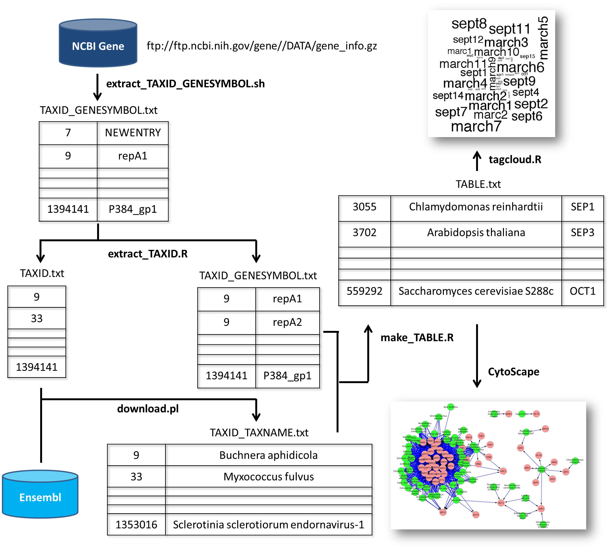

###「BioHack@JSBi2013」で使用したソースコード
=======

### Taxonomy ID, Taxonomy Name, Gene Symbolの対応関係をまとめるパイプライン



### データ解析手順
0. まず、NCBIのFTPサーバにある、gene_infoというファイルをダウンロードする(1.42GBあって重いので、Github上には保存していない)

ftp://ftp.ncbi.nih.gov/gene//DATA/gene_info.gz

1. gene_infoのうち1,3列目だけ切り出す
```
./extract_TAXID_GENESYMBOL.sh
```
TAXID_GENESYMBOL.txtというファイル（1列目はTaxonomy ID、2列目はGene Symbol）が生成される。ただし、2列目の一部にNEWENTRYという関係ない文字列が含まれている


2. TAXID_GENESYMBOL.txtのうち、NEWENTRYがある行を削除する。また、Taxonomy IDだけ別途抽出する
```r
R CMD BATCH extract_TAXID.R log1.txt
```
TAXID.txt(Taxonomy ID)、TAXID_TAXNAME.txt(NEWENTRYが無い行だけ抽出)、log1.txt（ログファイル）というファイルが生成される。


3. TAXID.txtに記述されたTAXIDをもとに、Ensemblにアクセスし、Taxonomy Nameをダウンロードする。
```perl
perl download.pl
```
TAXID_TAXNAME.txtというファイル（1列目がTaxonomy ID、2列目がTaxonomy Name）が生成される


4. 最後に、TAXID_GENESYMBOL.txtとTAXID_TAXNAME.txtを、同じTAXID同士でマージする
```r
R CMD BATCH make_table.R log2.txt
```
TABLE.txt、log2.txt(ログファイル)、Dictionary.txt(今回考慮した誤変換が起きる疑いがある文字列集)が生成される


### データ可視化手順
1. Rのtagcloudパッケージを利用して、検出頻度が高かった誤変換されるGene Symbolを強調する図を作成
```
cd TagCloud
R CMD BATCH tagcloud.R
cd ..
```

2. Cytoscapeを利用して、Taxonomy Name - Gene Symbolの共起ネットワークを作成
