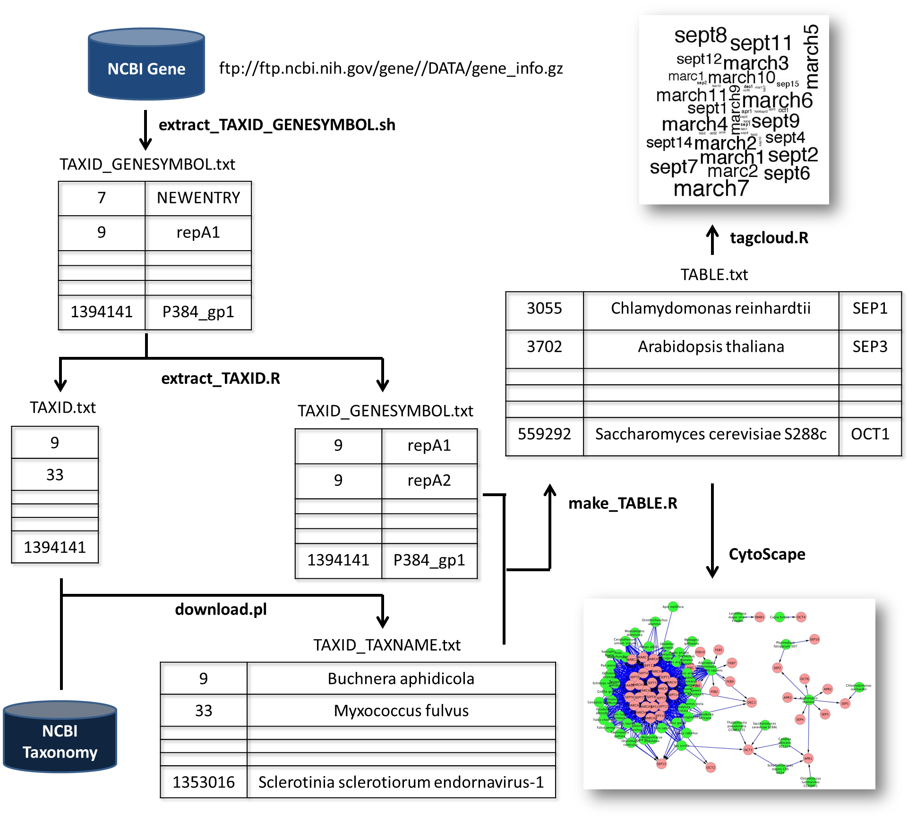

###「BioHack@JSBi2013」で使用したソースコード
=======

### Taxonomy ID, Taxonomy Name, Gene Symbolの対応関係をまとめるパイプライン



gene_infoは1.42GBあるファイルなので、GitHub上には保存していない（別途ダウンロードが必要）

ftp://ftp.ncbi.nih.gov/gene//DATA/gene_info.gz

### 手順
1. まずgene_infoのうち1,3列目だけ切り出す
```
./extract_TAXID_GENESYMBOL.sh
```
TAXID_GENESYMBOL.txtというファイルが生成される。1列目はTAXID、2列目はGENESYMBOLになる。ただし、2列目に一部NEWENTRYという文字列が含まれている


2. TAXID_GENESYMBOL.txtのうち、NEWENTRYがある列だけを削除する。また、TAXIDだけ別途抽出する
```r
R CMD BATCH extract_TAXID.R log1.txt
```
TAXID.txt、TAXID_TAXNAME.txt(中身が先ほどから一部変更)、log1.txt（ログファイル）というファイルが生成される。

3. Ensemblにアクセスし、TAXID.txtをもとに、Taxonomy Nameをダウンロードする。
```perl
perl download.pl
```
TAXID_TAXNAME.txtというファイルが生成される。

4. 
```r
R CMD BATCH make_table.R log2.txt
```
TABLE.txt、log2.txt(ログファイル)が生成される。